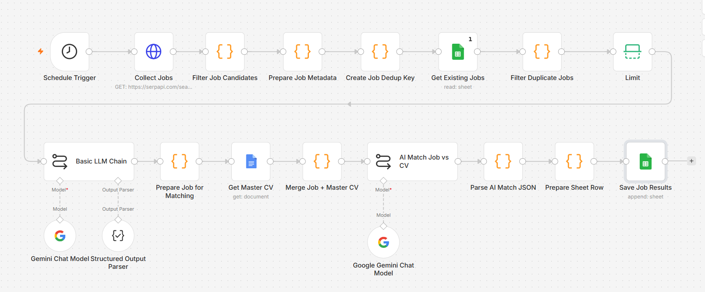

# AI Job Intelligence Agent

An AI-powered job intelligence workflow that automatically collects relevant job opportunities, evaluates their fit against a candidate profile, and produces a focused daily shortlist.

The goal is to reduce manual job searching and help candidates spend more time evaluating the opportunities that actually matter.

## 🎯 Project Overview

Job searching can become repetitive and time-consuming, especially when monitoring multiple job boards and reviewing dozens of job descriptions.

This project automates the first layer of the job-search process:

**Find → Filter → Analyze → Match → Rank → Shortlist**

Instead of manually reviewing every job, the workflow uses automation and AI to identify opportunities that are more aligned with the candidate's experience, target roles, and career direction.

## 💡 Business Problem

A typical job search requires candidates to:

* Search multiple sources every day
* Review large numbers of job postings
* Identify relevant roles manually
* Read lengthy job descriptions
* Compare requirements against their CV
* Estimate whether they are a strong candidate
* Maintain a shortlist of interesting opportunities

This repetitive process can consume significant time and makes it easy to miss relevant opportunities.

## 🚀 Solution

The AI Job Intelligence Agent creates an automated pipeline that collects job opportunities and evaluates them against a candidate's profile.

```text
Job Sources
     ↓
Job Collection
     ↓
Filter & Deduplicate
     ↓
AI Job Analysis
     ↓
CV / Profile Matching
     ↓
Match Evaluation
     ↓
Daily Shortlist
```

The AI acts as an **intelligence and prioritization layer**, while the final decision about whether to apply remains with the candidate.

## 🔄 Workflow Architecture



The workflow follows a structured process:

1. Collect relevant job postings.
2. Filter jobs based on target locations and role categories.
3. Remove irrelevant or duplicate opportunities.
4. Analyze each job description using AI.
5. Compare job requirements with the candidate's master CV/profile.
6. Estimate the level of fit.
7. Prioritize the most relevant opportunities.
8. Produce a focused daily shortlist.

## 🎯 Target Roles

The workflow is designed to support a broad business and operations-oriented career direction.

### Operations

* Operations Manager
* Business Operations
* Operational Excellence
* Operations-related leadership roles

### Strategy & Transformation

* Strategy & Operations
* Business Transformation
* Transformation Manager
* Strategy-related roles

### Project & Program Management

* Project Manager
* Program Manager
* PMO
* Project Management roles

### Business Leadership

* Business Manager
* BU Leader
* Similar business leadership and cross-functional management roles

The role scope can be adapted as the candidate's career direction evolves.

## 📍 Target Location

The initial search scope focuses on:

* **Da Nang, Vietnam**
* **Remote opportunities**

Additional locations can be added without changing the core intelligence workflow.

## ✨ Key Features

### 1. Automated Job Collection

The workflow reduces the need for repetitive manual searches by collecting job opportunities on a scheduled basis.

### 2. Relevance Filtering

Jobs are filtered based on target roles, location, and career direction before deeper AI analysis.

### 3. AI-Powered Job Analysis

AI analyzes job descriptions to identify:

* Core responsibilities
* Required skills
* Experience expectations
* Key qualifications
* Role characteristics

### 4. CV-to-Job Matching

Each relevant opportunity is compared against a master CV/profile to estimate how closely the candidate's experience aligns with the position.

### 5. Job Prioritization

Instead of presenting a large list of opportunities, the workflow focuses attention on the strongest matches.

### 6. Human-in-the-Loop Decision Making

The system does **not** make the final career decision.

AI provides analysis and prioritization; the candidate decides whether an opportunity is worth pursuing.

## 🧠 AI Evaluation Approach

The evaluation is designed to look beyond simple keyword matching.

Factors considered can include:

* Relevant experience
* Role responsibilities
* Management scope
* Project experience
* Business / operations exposure
* Required capabilities
* Seniority expectations
* Overall career alignment

This helps distinguish between a job that merely contains familiar keywords and one that genuinely fits the candidate's background.

## 🛠️ Technology Stack

| Technology             | Purpose                               |
| ---------------------- | ------------------------------------- |
| **n8n**                | Workflow automation and orchestration |
| **Job Sources / APIs** | Job opportunity collection            |
| **OpenAI**             | AI-powered job analysis and matching  |
| **Google Sheets**      | Job data and tracking                 |
| **AI Prompting**       | Structured job evaluation             |
| **Scheduled Workflow** | Daily job intelligence                |

## 📊 Example Daily Output

The intended output is a focused shortlist rather than an overwhelming job feed.

A typical result can include:

| Information      | Purpose                           |
| ---------------- | --------------------------------- |
| Job Title        | Identify the opportunity          |
| Company          | Employer information              |
| Location         | Geographic fit                    |
| Role Category    | Operations / Strategy / PM / etc. |
| Match Assessment | Estimated fit                     |
| Key Strengths    | Why the role matches              |
| Key Gaps         | Potential concerns                |
| Job URL          | Continue to application           |

## 🎯 Project Highlights

This project demonstrates how AI can be applied to a real-world knowledge workflow rather than simply generating text.

Key capabilities demonstrated:

* **AI-assisted decision support**
* **Automated information retrieval**
* **Structured data processing**
* **CV-to-job matching**
* **Business-oriented AI evaluation**
* **Workflow orchestration**
* **Human-in-the-loop decision making**

## 🔐 Security & Privacy

The public repository contains sanitized workflow assets prepared for portfolio purposes.

Private information such as:

* Personal credentials
* API keys
* Private account information
* Sensitive candidate information
* Production credentials

should not be included in the public workflow.

## 📁 Repository Structure

```text
ai-job-intelligence-agent/
│
├── README.md
│
├── assets/
│   └── workflow-overview.png
│
└── workflow/
    └── ai-job-intelligence-agent-clean.json
```

## 📌 Future Improvements

Potential future enhancements include:

* Historical job comparison
* Tracking changes in job descriptions
* Improved thesis / career-fit tracking
* Application status tracking
* Interview preparation assistance
* Personalized recommendations based on previous applications

The project is intentionally designed as a modular workflow so additional intelligence layers can be added over time.
